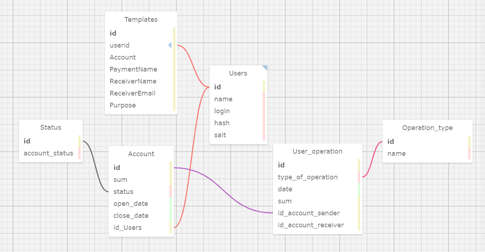

#### Схема базы данных  

  

***
### Маршруты
***
#### Аутентификация.

##### Создание нового пользователя. 

###### POST /Auth/SignUp

**Body:**  
 {  
 "Login": //Типа email (primer@primer.ru)   
 "Name": //Имя пользователя  не менее 3-х символов    
 "Password": //Пароль  
 "ConfirmPassword": // Повтор пароля  
}

**Response:**

- Status: 200 OK
- Редирект на страницу авторизации  
***
##### Авторизация. 

###### POST /Auth/SignIn

**Body:**  
 {  
 "Login": //Типа email (primer@primer.ru)   
 "Password": //Пароль  
}

**Response:**

- Status: 200 OK
- Body: Token
***  
***  
#### Счета
##### Создание нового счета
###### POST /Account/CreateAccount
**Body**  
{  
"Sum": // Начальная сумма  
"UserId": // id клиента  
}   

**Response:**

- Status: 200 OK
***

##### Пополнить счет
###### POST /Account/PutFund
**Body**  
{  
"Sum": // Сумма пополнения  
"ReceiverAccountId": // id счета пополнения  
}   

**Response:**

- Status: 200 OK
***

##### Перевод на другой счет
###### POST /Account/CreateTransaction
**Body**  
{  
"Date": // Дата операции ("2020-05-08")  
"Sum": // Сумма перевода  
"ReceiverAccountId": // id счта зачисления  
"SenderAccountId": // id счета отправителя  
"TypeOfOperation": // id типа платежа
}   

**Response:**

- Status: 200 OK

***
***
#### Информация о пользователе
###### GET /User/Get/:Login
Параметр: **"Login"** - логин пользователя

**Response:**

- Status: 200 OK
- Body: // Объект содержащий основную информацию о пользователе
